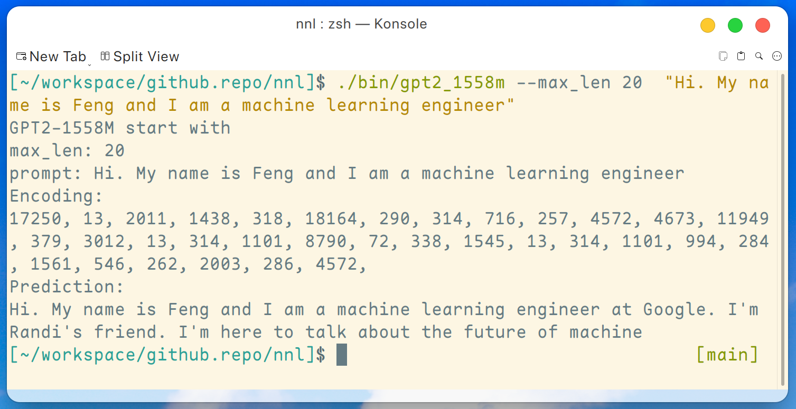
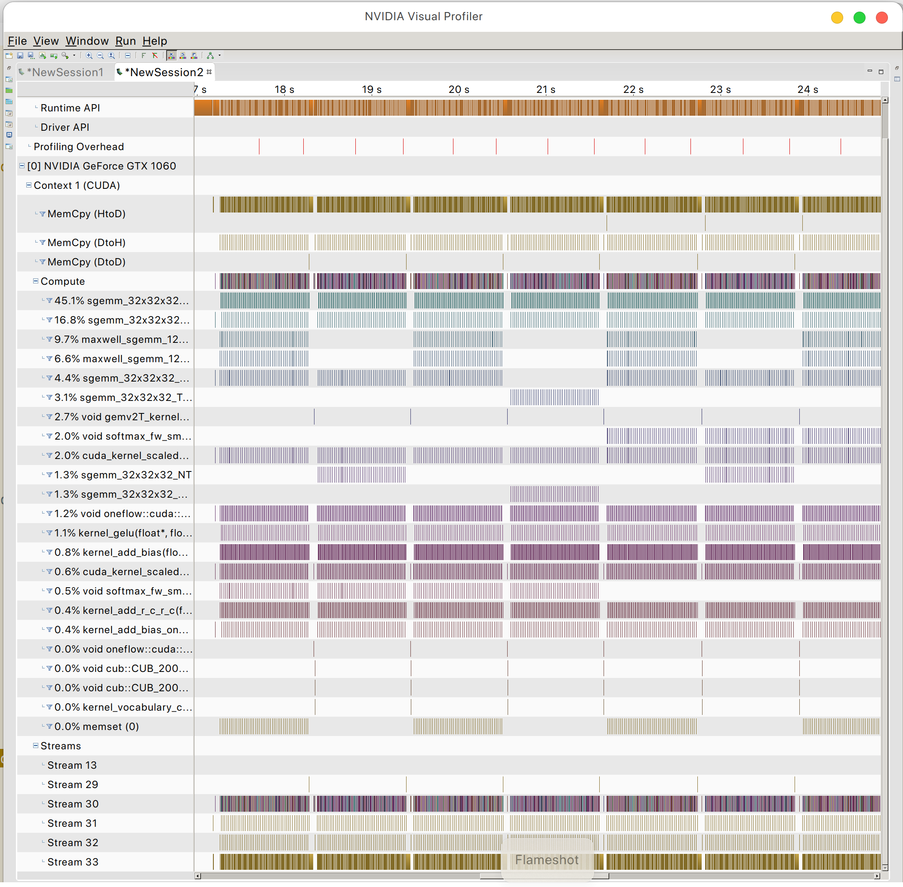
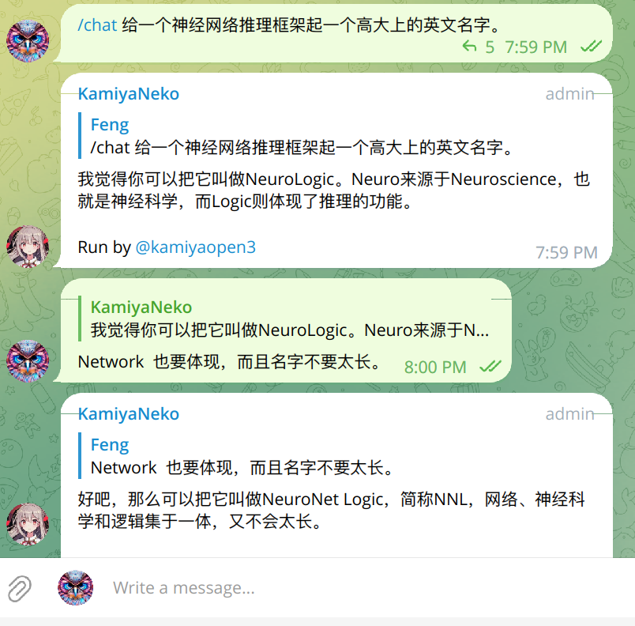

# NeuralNet Logic
----------------------
NNL is an inference engine for large models on low-memory GPU platform.


## Contents
- [Introduction](#introduction)
- [Build the library](#build-the-library)
- [GPT2-XL Example](#gpt2-xl-example)
- [Roadmap](#roadmap)
- [License](#license)
- [Acknowledgements](#acknowledgements)

## Introduction

Big models are too large to fit into the GPU memory.
NNL addresses this problem with a trade-off between PCIE bandwidth and memory.

A typical inference pipeline is as follows:
1. compose the computation graph with a [model](https://github.com/fengwang/nnl/blob/676977d6793926d922dd7a97c487ec3e0caee856/include/direct_space/model.hpp#L15)
2. topological sort each node in the computation graph to make [a computation table](https://github.com/fengwang/nnl/blob/676977d6793926d922dd7a97c487ec3e0caee856/include/direct_space/model.hpp#L131C53-L131C53)
3. for i in [1, 2, 3, ..., n]:
    - execute [the following tasks asynchronously](https://github.com/fengwang/nnl/blob/676977d6793926d922dd7a97c487ec3e0caee856/include/direct_space/model.hpp#L153)
        + compute the output of node i
        + load the weights to GPU for node i+1
        + allocate the GPU memory (output tensor and cahces) for node i+1
        + deallocate the GPU memory (output tensors, weights and caches) for node i-1

With GPU memory pool and memory defragmentation, NNIL makes it possible to inference a large model on a low-end GPU platform.

## Build the library

This is just a hobby project written up in a few weeks, currently only CUDA backend is supported.

### Tested with
+ gcc 13.2.1
+ cuda 12.2
+ cudnn 8.9.2.26

### Build the static library

```bash
make libnnl_cuda.a && make libnnl_cuda_kernels.a
```

This command will build the two static libraries: __lib/libnnl_cuda.a__ and __lib/libnnl_cuda_kernels.a__.
The first one is the core library with CUDA backend in C++, and the second one is for the CUDA kernels.

## GPT2-XL Example

A demo program of GPT2-XL (1.6B) is provided [here](./examples/gpt2-1558M/main.cc).
This program can be compiled by this command:
```bash
make gpt2_1558m
```

After downloading all the weights from the [release](https://github.com/fengwang/nnl/releases/tag/0.0.1), we can run the following command on a low-end GPU platform such as GTX 1050 (2 GB memory):

```bash
./bin/gpt2_1558m --max_len 20  "Hi. My name is Feng and I am a machine learning engineer"
```

And the output is like this:


Disclaimer: this is just an example generated by gpt2-xl, I am not working at Google and I do not know Randi.

And you can find the GPU memory access pattern




## Roadmap
+ [ ] int8 support
+ [ ] more layers
+ [ ] more example applications
+ [ ] weight persistence in case of a small model

## License

[PeaceOSL](https://github.com/atErik/PeaceOSL/blob/main/PeaceOSL.txt)

## Acknowledgements
+ [oneflow](https://github.com/Oneflow-Inc/oneflow)
+ [nlohmann_json](https://github.com/nlohmann/json)
+ [spdlog](https://github.com/gabime/spdlog)

## Why NNL?



